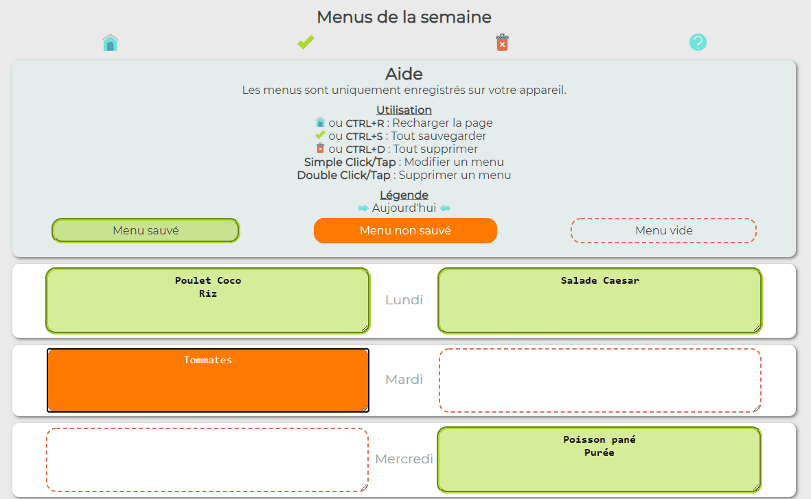

# Mini projet PHP & JavaScript
## Gestion simple de la liste des repas d'une semaine
C'est une page simple permettant de noter les repas d'une semaine.
 
 
 
 * Grâce au **CSS**, la page est adaptée aux PC et aux mobiles.
 * Les menus sont sauvegardés localement dans des cookies en utilisant **PHP**. 
 * L'affichage est interactif et des raccourcis utilisables grâce au **Javascript**.

N'hésitez-pas à visiter mon site [https://serialif.com/](https://serialif.com/)  

---

# Mini PHP & JavaScript project
## Simple management of a week's meal list
It's a simple page for recording meals for a week.
 
 
 
  * Thanks to **CSS**, the page is adapted to PC and mobile.
  * Menus are saved locally in cookies using **PHP**.
  * The display is interactive and the shortcuts can be used thanks to **Javascript**.

Do not hesitate to visit my site [https://serialif.com/](https://serialif.com/)